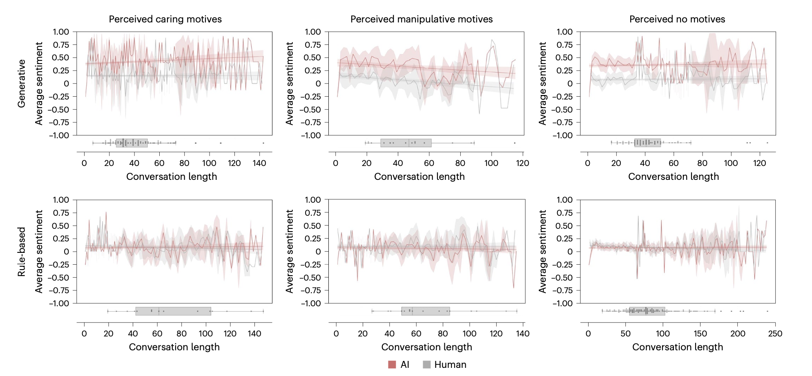
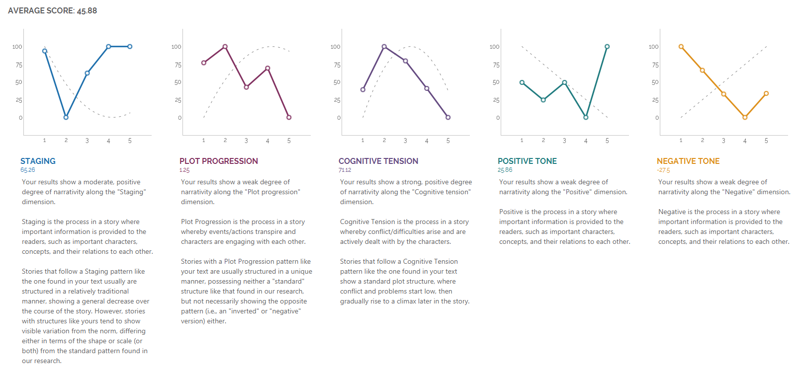

# analysis aspect

## Conversation data

### Conversation Length
 Line 1: Human
 Line 2: AI

Groups| Single Character Chatting | Group Chatting | Sage Agent 
--|----------|----------|----------
With sage agent group|  |  |
Without sage agent group|  |  |

### Time Duration

### Sage Agent -- Topic

Which types of guidance they gave

## Story

### Narration Arc and Cognition Tension

Link: https://www.liwc.app/help/aon

## Scale

### Tests for Small Samples (p-value)

1. **Student's t-test (for small, independent samples):**
   - **Usage**: Suitable when you have two independent groups with small sample sizes. It's often used when the sample sizes are less than 30.
   - **Assumptions**: Assumes that the data are normally distributed and the variances in the two groups are equal (homoscedasticity).
   - **Data Type**: Typically used for continuous data, although it can be applied to discrete data if the normality assumption is met.
   - **Conclusion**: Determines if there is a significant difference between the means of the two groups.
   - **Sensitivity**: More sensitive to outliers compared to non-parametric tests.
2. **Mann-Whitney U Test (non-parametric):**
   - **Usage**: Applicable when the data does not meet the normality assumption. It’s a good alternative to the t-test for small samples that are not normally distributed.
   - **Assumptions**: Assumes that the two samples are independent and that the observations are ordinal or continuous.
   - **Data Type**: Suitable for ordinal data (like Likert scales) or continuous data that is not normally distributed.
   - **Conclusion**: Tests whether one sample is stochastically greater than the other, a useful test for median differences.
   - **Sensitivity**: Less sensitive to outliers and more robust for smaller sample sizes or non-normal data.

### System Usability Scale (SUS)

The System Usability Scale (SUS) is a straightforward and widely used tool for assessing usability. It consists of 10 questions, each answered on a scale of 1 to 5, where 1 is "Strongly Disagree" and 5 is "Strongly Agree". To calculate the SUS score, follow these steps:

1. **Score Individual Items**:
   - For odd-numbered questions (1, 3, 5, 7, 9): Subtract 1 from the user's response.
   - For even-numbered questions (2, 4, 6, 8, 10): Subtract the user's response from 5.
2. **Calculate the Total Score**:
   - Add up the scores of all questions.
3. **Adjust the Total to Obtain the Final SUS Score**:
   - Multiply the total score by 2.5.

