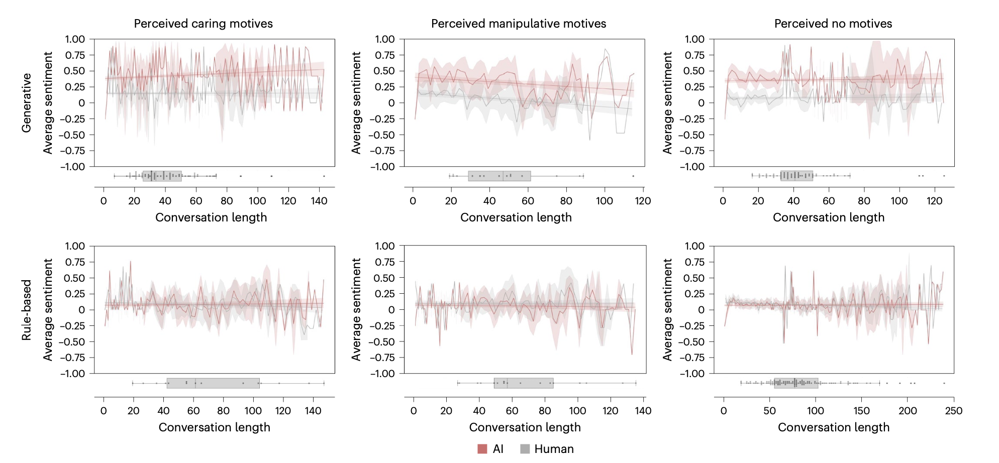
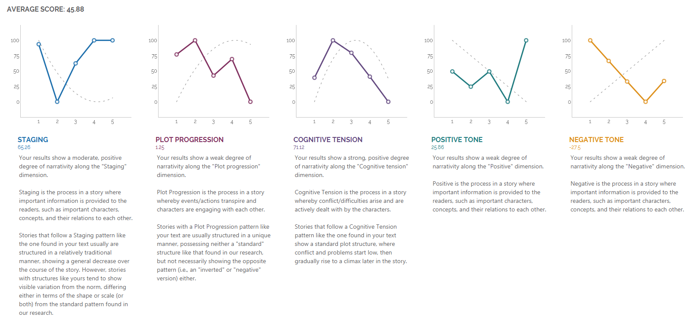
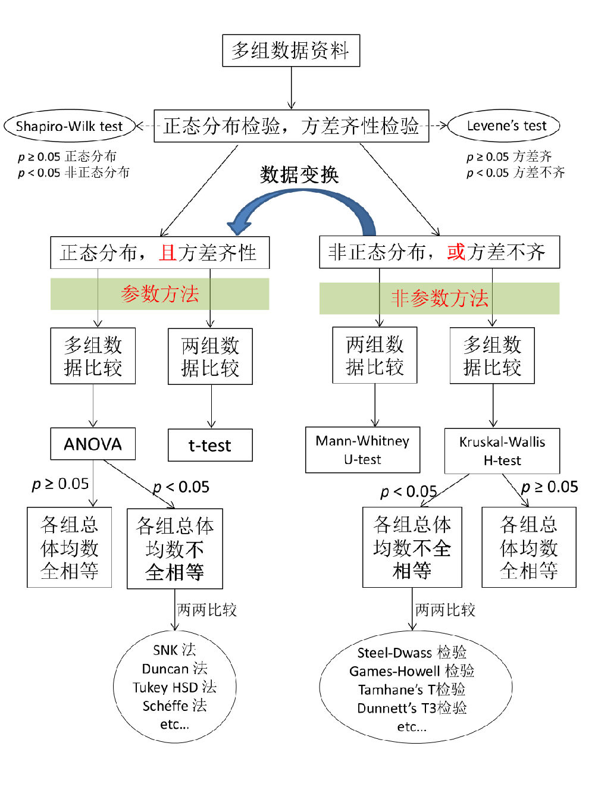
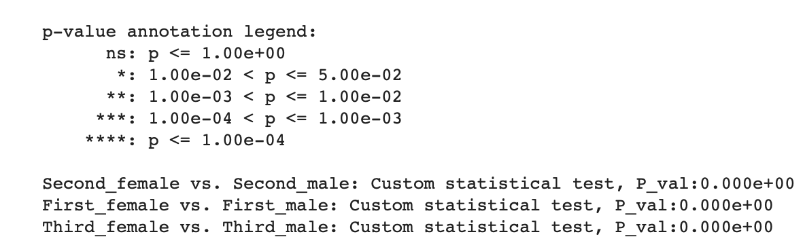
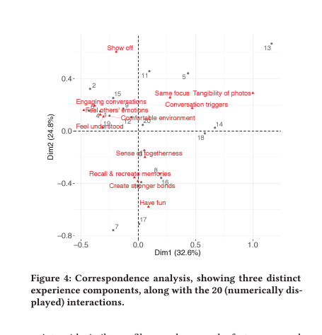

# Analysis Plan

## Conversation data

### Conversation Length
 Line 1: Human
 Line 2: AI

Groups| Single Character Chatting | Group Chatting | Sage Agent 
--|----------|----------|----------
With sage agent group|  |  |
Without sage agent group|  |  |N/A

### Conversation Length

- Reference: Beliefs about AI influence human-AI interaction and can be manipulated to increase perceived trustworthiness, empathy, and effectiveness

### Engagement Analysis

1. **Data Preparation**:
   - Extract conversation logs between humans and the AI.
   - Ensure the data is clean and structured, with clear demarcations of each message and its sender (human or AI).
2. **Conversation Round Counting**:
   - Define a "conversation round": typically, this is a pair of interactions where one party initiates or asks, and the other responds.
   - Count the number of rounds in each conversation. This can be done programmatically by iterating through the conversation logs and counting each exchange.
3. **Word Count Analysis**:
   - Calculate the number of words in each sentence or message. This can be done by splitting each message into words (using spaces and punctuation as separators) and counting them.
   - Determine the average word count per sentence for both human and AI participants. This involves summing up the word counts of all messages by each party and dividing by the number of messages.
4. **Statistical Analysis**:
   - Compute descriptive statistics like mean, median, and standard deviation for both the number of rounds per conversation and the average word count per message.
   - Optionally, perform more advanced statistical analysis to uncover trends or significant differences in conversation lengths and word counts under different conditions (e.g., time of day, type of query).
5. **Visual Representation**:
   - Use graphs and charts to visually represent the data. For example, histograms can show the distribution of conversation lengths and word counts.
   - Scatter plots might help in visualizing the relationship (if any) between the length of the conversation and the verbosity of messages.

### Sage Agent -- Topic

Which types of guidance they gave

## Story

### Narration Arc and Cognition Tension

Link: https://www.liwc.app/help/aon

Need to do time series analysis

## Scale

### Tests for Small Samples (p-value)

1. **Student's t-test (for small, independent samples):**
   - **Usage**: Suitable when you have two independent groups with small sample sizes. It's often used when the sample sizes are less than 30.
   - **Assumptions**: Assumes that the data are normally distributed and the variances in the two groups are equal (homoscedasticity).
   - **Data Type**: Typically used for continuous data, although it can be applied to discrete data if the normality assumption is met.
   - **Conclusion**: Determines if there is a significant difference between the means of the two groups.
   - **Sensitivity**: More sensitive to outliers compared to non-parametric tests.
2. **Mann-Whitney U Test (non-parametric):**
   - **Usage**: Applicable when the data does not meet the normality assumption. It’s a good alternative to the t-test for small samples that are not normally distributed.
   - **Assumptions**: Assumes that the two samples are independent and that the observations are ordinal or continuous.
   - **Data Type**: Suitable for ordinal data (like Likert scales) or continuous data that is not normally distributed.
   - **Conclusion**: Tests whether one sample is stochastically greater than the other, a useful test for median differences.
   - **Sensitivity**: Less sensitive to outliers and more robust for smaller sample sizes or non-normal data.

### Table -- Narration Transporation

- Y: score
- X: items
- each itesm -- two bars (with agent/without agent)
- P-value should be labed on two bars for each item
- Conclusion: under this table (dimension), with agent and without agent group has significant difference on xxx xxx and xxx items (aspects/detailed questions), but has no significant difference on the rest aspects. [sage agent compared to no sage agent]

### Table -- Non-cognitive 

- Conclusion: there are many aspects under the non-cogntives, such as self-control and xxx. And we found our system is better at improving or benefits reflection on aspects a. b and c (larger score), and bad at the rest. [comprasion among the items]
- Non-cognitive: a, b, c, d, e, f, g
  - Hypothsis: a and d maybe are interconnected. 
  - Correspondent analysis
    - Reference: https://dl.acm.org/doi/10.1145/3290605.3300897
    - 

### System Usability Scale (SUS)

The System Usability Scale (SUS) is a straightforward and widely used tool for assessing usability. It consists of 10 questions, each answered on a scale of 1 to 5, where 1 is "Strongly Disagree" and 5 is "Strongly Agree". To calculate the SUS score, follow these steps:

1. **Score Individual Items**:
   - For odd-numbered questions (1, 3, 5, 7, 9): Subtract 1 from the user's response.
   - For even-numbered questions (2, 4, 6, 8, 10): Subtract the user's response from 5.
2. **Calculate the Total Score**:
   - Add up the scores of all questions.
3. **Adjust the Total to Obtain the Final SUS Score**:
   - Multiply the total score by 2.5.

